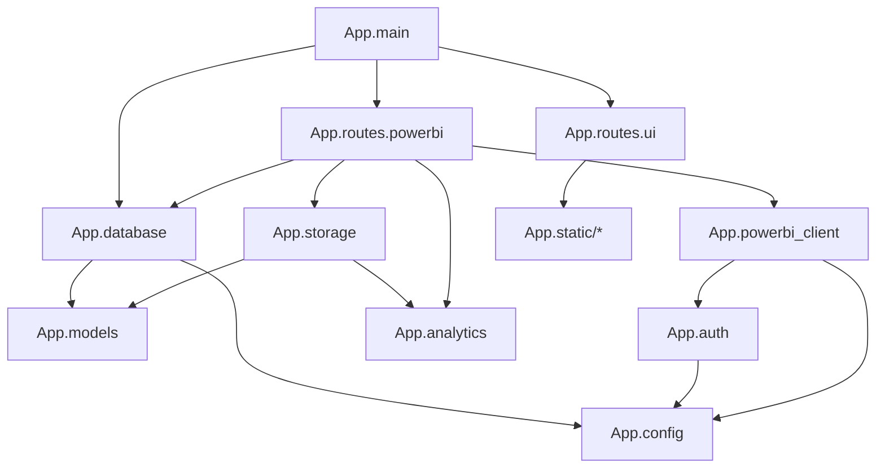
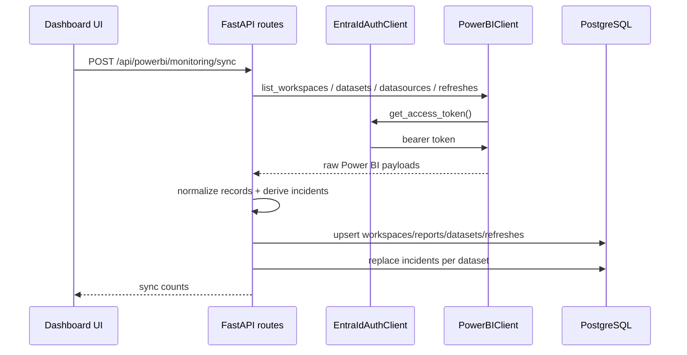
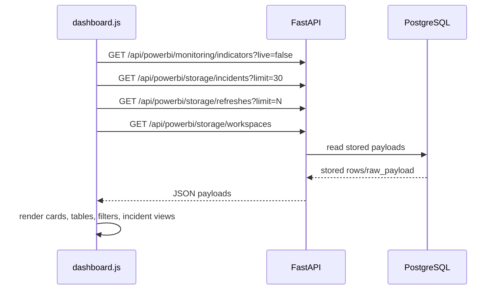
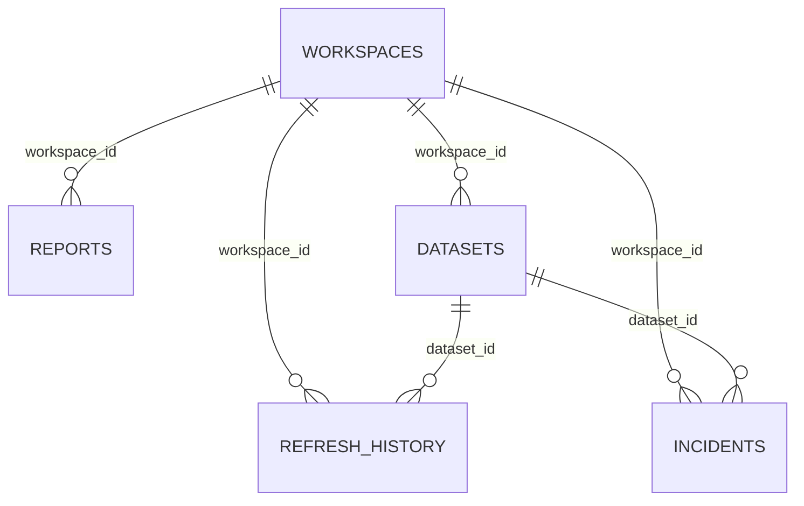

# PROJECT_DOCUMENTATION

## 1. Project Overview

### Purpose

This project is a FastAPI-based backend service plus a static HTML/CSS/JavaScript dashboard for monitoring Microsoft Power BI assets and refresh activity.

The service:

- Authenticates to Microsoft Entra ID using the OAuth2 client credentials flow.
- Calls the Power BI REST API.
- Normalizes workspace, dataset, datasource, refresh, and incident-related data.
- Stores normalized and raw monitoring data in PostgreSQL.
- Exposes both live and stored monitoring endpoints.
- Serves a dashboard UI that reads stored data and can trigger live synchronization.

### Domain

Operational monitoring / observability for Power BI workspaces and dataset refreshes.

### Supported Features

Supported by the current code:

- Health endpoint.
- Root redirect to dashboard.
- Static dashboard UI served from FastAPI.
- Live Power BI data fetch for:
  - workspaces
  - reports
  - datasets
  - dataset datasources
  - dataset refresh history
- Persistence of workspaces, reports, datasets, refresh history, and derived incidents.
- Derived monitoring indicators:
  - refresh totals
  - success and failure rates
  - average and maximum refresh duration
  - slowest datasets
  - datasets with most failures
  - delayed refresh count
  - duration anomaly count
  - incident breakdowns by cause, gateway, capacity, credentials, and datasource
- Dashboard interactions:
  - view switching by hash
  - reload
  - sync
  - load more refreshes
  - refresh filtering by date and status
  - refresh sorting

### Current Status

Inferred from code and tests:

- The backend starts successfully when required environment variables and a reachable PostgreSQL database are available.
- The dashboard can operate against stored data without immediately calling live Power BI endpoints.
- Live synchronization depends on outbound network access to Microsoft Entra and Power BI APIs.
- No production-grade deployment automation is present in the repository.
- No schema migration system is present.

### Important Constraints

- The project is tightly coupled to PostgreSQL because models use `JSONB` and storage uses PostgreSQL upsert behavior (`sqlalchemy.dialects.postgresql.insert(...).on_conflict_do_update(...)`).
- The application stores large portions of raw external payloads alongside normalized fields.
- The frontend is plain static JavaScript with direct DOM manipulation; there is no frontend build system.


### Top-level workspace structure

| Path | Type | Purpose |
| --- | --- | --- |
| `.git/` | Git metadata | Workspace VCS metadata. |
| `.gitignore` | Config | Ignores `olive_backend_staging/.venv/`, `olive_backend_staging/.env`, log files, `.pyc`, and `__pycache__`. |
| `olive_backend_staging/` | Project directory | Main application codebase. |

### Application structure

| Path | Type | Purpose |
| --- | --- | --- |
| `.env` | Local config | Real environment file exists locally. Contents are intentionally not documented here. |
| `.env.example` | Template config | Documents required environment variables. |
| `.pytest_cache/` | Generated | Pytest cache generated by local test runs. Not application code. |
| `.venv/` | Generated/runtime | Local Python virtual environment. Not part of application source. |
| `App/` | Source package | Backend code and static frontend assets. |
| `README.md` | Docs | Short usage and endpoint summary. |
| `requirements.txt` | Dependencies | Runtime Python dependencies. |
| `requirements-dev.txt` | Dependencies | Test/dev dependencies layered on top of runtime requirements. |
| `tests/` | Test code | Automated smoke and error-path tests. |
| `uvicorn-*.log`, `uvicorn-*.err.log` | Runtime artifacts | Local server logs from previous manual runs. |

### `App/` breakdown

| Path | Purpose |
| --- | --- |
| `App/__init__.py` | Package marker with a short docstring. |
| `App/main.py` | FastAPI app creation, router registration, static mount, lifespan startup, health endpoint. |
| `App/config.py` | Environment loading, settings assembly, DB URL normalization. |
| `App/database.py` | SQLAlchemy engine/session factory initialization and access. |
| `App/models.py` | SQLAlchemy ORM models and table schema. |
| `App/auth.py` | Microsoft Entra token acquisition and in-memory token caching. |
| `App/powerbi_client.py` | Low-level Power BI REST API wrapper. |
| `App/analytics.py` | Data normalization, incident derivation, monitoring summarization. |
| `App/storage.py` | PostgreSQL persistence and read access layer. |
| `App/routes/__init__.py` | Route package marker. |
| `App/routes/ui.py` | Root redirect and dashboard HTML file serving. |
| `App/routes/powerbi.py` | All API routes and orchestration logic. |
| `App/static/dashboard.html` | Dashboard markup. |
| `App/static/dashboard.css` | Dashboard styling and responsive layout. |
| `App/static/dashboard.js` | Dashboard behavior, rendering, filtering, API calls. |
| `App/static/olivesoft-logo-transparent.png` | Static image asset present in repository. It is not referenced by `dashboard.html` in the current code. |

### `tests/` breakdown

| Path | Purpose |
| --- | --- |
| `tests/test_smoke.py` | Uses FastAPI `TestClient` and test doubles to cover UI routes, stored/live API smoke tests, sync flow, empty storage behavior, invalid IDs, and upstream error mapping. |

## 2. Tech Stack

### Languages

| Layer | Language |
| --- | --- |
| Backend | Python 3.x |
| Frontend | HTML, CSS, JavaScript |

### Backend Frameworks and Libraries

From `requirements.txt` and imports:

| Dependency | Role |
| --- | --- |
| `fastapi==0.116.1` | Web framework and routing. |
| `uvicorn[standard]==0.35.0` | ASGI server for local runtime. |
| `SQLAlchemy==2.0.42` | ORM and SQL layer. |
| `pg8000==1.31.2` | PostgreSQL driver used via SQLAlchemy. |
| `requests==2.32.4` | Outbound HTTP calls to Entra ID and Power BI. |
| `python-dotenv==1.1.1` | Loads `.env` file into environment variables. |

### Test Dependencies

From `requirements-dev.txt`:

| Dependency | Role |
| --- | --- |
| `pytest>=8.3,<9` | Test runner. |
| `httpx>=0.28,<0.29` | Required by FastAPI/Starlette `TestClient`. |

### Database

| Component | Status |
| --- | --- |
| PostgreSQL | Required by code. |
| JSONB columns | Required by models. |
| Migrations | Not present. |

### External APIs

| API | Purpose |
| --- | --- |
| Microsoft Entra ID OAuth2 token endpoint | Service principal authentication. |
| Microsoft Power BI REST API (`/groups`, `/reports`, `/datasets`, `/datasources`, `/refreshes`) | Monitoring data source. |

### Infrastructure / Deployment

| Area | Status |
| --- | --- |
| Docker | Not present in repository. |
| CI/CD pipeline config | Not present in repository. |
| Cloud deployment descriptors | Not present in repository. |
| Reverse proxy config | Unknown. |
| Process manager config | Unknown. |

## 3. Architecture

### High-Level Style

This is a layered monolithic web service with:

- configuration layer
- database/session layer
- ORM model layer
- external API client layer
- analytics/normalization layer
- storage/repository layer
- route/controller layer
- static frontend layer

No dependency injection framework is used; dependencies are resolved through module-level helper functions and `lru_cache`.

### Core Module Dependencies



### Runtime Data Flow

#### Live sync path



#### Dashboard read path



### Design Patterns Used

| Pattern | Where |
| --- | --- |
| Cached singleton-style factory | `get_settings()`, `get_auth_client()`, `get_powerbi_client()`, `_get_session_factory()` |
| Repository/storage layer | `PowerBIStorage` |
| Thin route/controller functions | `App/routes/powerbi.py` |
| Static utility functions | `App/analytics.py` |
| Client wrapper over external HTTP API | `PowerBIClient`, `EntraIdAuthClient` |

### Architectural Observations

- Startup eagerly initializes the DB engine and runs `Base.metadata.create_all(...)`.
- Route handlers orchestrate multiple concerns directly; there is no separate service layer.
- Frontend and backend are tightly coupled through exact JSON shapes.
- Some "business logic" exists in `analytics.py` and some orchestration logic exists directly in route handlers.

## 5. Code Documentation

This section summarizes the important files, classes, and functions.

### `App/main.py`

#### Responsibility

- Creates the FastAPI application.
- Registers application routers.
- Mounts static assets.
- Initializes the database during startup.
- Exposes a health endpoint.

#### Main Elements

| Symbol | Responsibility | Inputs | Outputs | Side effects |
| --- | --- | --- | --- | --- |
| `lifespan` | Startup hook | FastAPI app instance | async context manager | Calls `init_db()` on startup |
| `app` | ASGI app | N/A | FastAPI instance | Registers routers and static files |
| `health_check` | Health endpoint | HTTP GET | `{"status": "ok"}` | None |

#### Dependencies

- `App.database.init_db`
- `App.routes.powerbi.router`
- `App.routes.ui.router`
- `fastapi.staticfiles.StaticFiles`

#### Error Handling

- No explicit startup error handling; DB initialization exceptions will fail app startup.

### `App/config.py`

#### Responsibility

- Loads environment variables from `.env`.
- Validates required env vars.
- Constructs the runtime settings object.
- Normalizes DB URL formats to the expected SQLAlchemy + pg8000 form.

#### Main Elements

| Symbol | Responsibility |
| --- | --- |
| `BASE_DIR`, `ENV_PATH` | Resolve project root and `.env` path. |
| `_require_env(name)` | Raises `RuntimeError` if env var is missing or empty. |
| `_normalize_database_url(url)` | Rewrites `postgres://`, `postgresql://`, or `postgresql+psycopg2://` to `postgresql+pg8000://`. |
| `Settings` | Frozen dataclass storing auth, API, and DB settings. |
| `Settings.token_url` | Builds Entra token endpoint from `tenant_id`. |
| `get_settings()` | Cached settings factory. |

#### Inputs / Outputs

- Inputs:
  - process environment
  - `.env` file loaded via `python-dotenv`
- Outputs:
  - `Settings` dataclass

#### Business Logic

- If `DATABASE_URL` exists, it is normalized.
- Otherwise, the DB URL is assembled from:
  - `POSTGRES_HOST`
  - `POSTGRES_PORT` default `5432`
  - `POSTGRES_DB`
  - `POSTGRES_USER`
  - `POSTGRES_PASSWORD` URL-encoded with `quote_plus`

#### Error Handling

- Missing required env vars raise `RuntimeError`.
- There is no fallback/default for tenant ID, client ID, or client secret.

### `App/database.py`

#### Responsibility

- Creates the SQLAlchemy engine and session factory.
- Ensures tables exist.
- Provides DB sessions.

#### Main Elements

| Symbol | Responsibility |
| --- | --- |
| `_get_session_factory()` | Cached creation of engine and `sessionmaker`. |
| `init_db()` | Warm-up wrapper for startup. |
| `get_db_session()` | Returns a SQLAlchemy `Session`. |

#### Dependencies

- `App.config.get_settings`
- `App.models.Base`
- `sqlalchemy.create_engine`

#### Side Effects

- Executes `Base.metadata.create_all(bind=engine)` when session factory is first created.

#### Error Handling

- No explicit handling; DB connection or schema creation errors propagate.

### `App/models.py`

#### Responsibility

- Defines relational schema and ORM mappings.

#### Models

| Model | Key fields | Notes |
| --- | --- | --- |
| `Workspace` | `id` PK | Stores normalized top-level metadata and `raw_payload` JSONB. |
| `Report` | `id` PK | Stores report metadata plus `workspace_id`, `dataset_id`, URLs, and `raw_payload`. |
| `Dataset` | `id` PK | Stores dataset metadata plus `workspace_id` and `raw_payload`. |
| `RefreshHistory` | `id` int PK, unique `(workspace_id, dataset_id, request_id)` | Stores refresh execution history and `raw_payload`. |
| `Incident` | `id` PK | Stores derived incidents and `raw_payload`. |

#### Relationships

- No SQLAlchemy `relationship()` fields are defined.
- Logical relationships exist only through string ID columns such as:
  - `Report.workspace_id -> Workspace.id`
  - `Dataset.workspace_id -> Workspace.id`
  - `RefreshHistory.workspace_id -> Workspace.id`
  - `RefreshHistory.dataset_id -> Dataset.id`
  - `Incident.workspace_id -> Workspace.id`
  - `Incident.dataset_id -> Dataset.id`

#### Validation

- Validation is minimal and delegated mostly to SQLAlchemy column nullability.
- No Pydantic request/response models are defined for these entities.

### `App/auth.py`

#### Responsibility

- Acquires and caches an Entra bearer token for Power BI API requests.

#### Main Elements

| Symbol | Responsibility |
| --- | --- |
| `EntraIdAuthClient` | Handles token retrieval and in-memory token caching. |
| `get_access_token(force_refresh=False)` | Returns cached token if still valid, otherwise performs token request. |
| `get_auth_client()` | Cached client factory. |

#### Inputs / Outputs

- Inputs:
  - `Settings.token_url`
  - client credentials
- Outputs:
  - bearer token string

#### Business Logic

- Tokens are cached in memory using `_token` and `_expires_at`.
- Cached token is reused until within 60 seconds of expiration.

#### Side Effects

- Outbound POST request to the Entra token endpoint.

#### Error Handling

- Relies on `response.raise_for_status()`.
- HTTP/network exceptions propagate to callers.

### `App/powerbi_client.py`

#### Responsibility

- Provides a typed wrapper around Power BI REST operations used by the application.

#### Main Elements

| Method | Responsibility |
| --- | --- |
| `_request(method, path, params=None)` | Generic authenticated Power BI request. |
| `_value(payload)` | Extracts `payload["value"]` or returns `[]`. |
| `list_workspaces()` | Calls `GET groups`. |
| `list_workspace_reports(workspace_id)` | Calls `GET groups/{workspace_id}/reports`. |
| `list_workspace_datasets(workspace_id)` | Calls `GET groups/{workspace_id}/datasets`. |
| `list_dataset_datasources(workspace_id, dataset_id)` | Calls `GET groups/{workspace_id}/datasets/{dataset_id}/datasources`. |
| `list_dataset_refresh_history(workspace_id, dataset_id, top=10)` | Calls `GET groups/{workspace_id}/datasets/{dataset_id}/refreshes?$top=top`. |

#### Business Logic

- All requests include bearer auth and JSON content type headers.
- If a response returns `401`, the client forces a token refresh and retries once.

#### Error Handling

- `response.raise_for_status()` propagates `requests.HTTPError`.
- Network exceptions propagate directly.

### `App/analytics.py`

#### Responsibility

- Converts raw Power BI payloads into application-friendly records.
- Extracts error information.
- Derives incidents from refresh history.
- Computes aggregate indicators.

#### Key Constants

| Constant | Value | Meaning |
| --- | --- | --- |
| `DEFAULT_DELAY_THRESHOLD_SECONDS` | `3600` | Refresh duration threshold for delayed refresh classification. |
| `DEFAULT_DURATION_ANOMALY_FACTOR` | `1.5` | Relative threshold for anomaly detection vs. dataset average completed refresh duration. |
| `MINIMUM_ANOMALY_DURATION_SECONDS` | `300` | Absolute minimum duration before anomaly logic can trigger. |

#### Utility Functions

| Function | Responsibility |
| --- | --- |
| `parse_datetime(value)` | Parses ISO timestamps and converts trailing `Z` to `+00:00`. |
| `_now_utc()` | Current UTC time. |
| `_round(value)` | Rounds numeric value to two decimals. |
| `_extract_error_details(raw_exception)` | Extracts code/message from dict or JSON-like error payloads. |
| `_connection_summary(connection_details)` | Produces a concise datasource summary string. |

#### Record Builders

| Function | Input | Output | Notes |
| --- | --- | --- | --- |
| `build_workspace_record(raw_workspace)` | Raw Power BI workspace | Normalized workspace dict | Adds `workspaceId`, `workspaceName`, `capacityMode`, etc. |
| `build_datasource_record(raw_datasource)` | Raw datasource | Datasource dict | Adds `sourceSummary`. |
| `build_dataset_record(raw_dataset, workspace, datasources)` | Raw dataset + context | Normalized dataset dict | Adds datasource/gateway/capacity fields. |
| `build_refresh_record(raw_refresh, workspace, dataset)` | Raw refresh + context | Normalized refresh dict | Calculates durations, errors, delayed flag. |

#### Incident Logic

`derive_incidents(refreshes)` can generate multiple incidents per refresh.

Incident types supported by code:

- `FailedRefresh`
- `DelayedRefresh`
- `DurationAnomaly`
- `RefreshNotExecuted`
- `ConsecutiveFailures`

Cause classification heuristics are string-based and examine `errorCode`, `errorMessage`, and dataset metadata.

Possible `suspectedCause` values seen in code:

- `Credentials`
- `Gateway`
- `Capacite`
- `Power Query`
- `Modele semantique`
- `Planification`
- `Source de donnees`

Severity values seen in code:

- `Haute`
- `Moyenne`

No `Faible` incidents are generated by backend logic, although the frontend translation logic supports it.

#### Summary Logic

`summarize_monitoring(refreshes, incidents)` returns:

- `totals`
- `rates`
- `durations`
- `datasets`
- `incidents`
- `thresholds`

This output shape is consumed directly by the frontend.

#### Side Effects

- None. This module is pure transformation logic.

#### Error Handling

- Mostly defensive defaults.
- Invalid JSON in error payloads falls back to string conversion.

### `App/storage.py`

#### Responsibility

- Reads/writes monitoring data to PostgreSQL.

#### Main Elements

| Method | Responsibility |
| --- | --- |
| `upsert_workspaces(workspaces)` | Upserts workspace rows by PK. |
| `upsert_reports(workspace_id, reports)` | Upserts report rows by PK. |
| `upsert_datasets(workspace_id, datasets)` | Upserts dataset rows by PK. |
| `upsert_refresh_history(workspace_id, dataset_id, refresh_history)` | Upserts refresh history using unique constraint. |
| `replace_incidents(workspace_id, dataset_id, incidents)` | Deletes all existing incidents for a dataset, then inserts/upserts new ones. |
| `get_workspaces()` | Returns `raw_payload` list ordered by name. |
| `get_reports()` | Returns `raw_payload` list ordered by name. |
| `get_datasets()` | Returns `raw_payload` list ordered by name. |
| `get_refresh_history(...)` | Returns `raw_payload` list ordered by `start_time DESC`. |
| `get_incidents(...)` | Returns `raw_payload` list ordered by `detected_at DESC`. |

#### Important Business Rules

- Raw payloads are treated as the primary read model for API responses.
- Incidents are replaced dataset-by-dataset rather than incrementally merged.
- Commits happen inside each storage method.

#### Side Effects

- Inserts, updates, deletes, and commits SQL transactions.

#### Error Handling

- No explicit transaction rollback logic.
- DB exceptions propagate.

### `App/routes/ui.py`

#### Responsibility

- Serves the UI entry points.

#### Endpoints

| Endpoint | Behavior |
| --- | --- |
| `GET /` | Redirects to `/dashboard` with `RedirectResponse`. |
| `GET /dashboard` | Returns `dashboard.html` via `FileResponse`. |

### `App/routes/powerbi.py`

#### Responsibility

- Exposes all monitoring API routes.
- Orchestrates live Power BI retrieval, normalization, persistence, and response generation.

#### Internal Helpers

| Helper | Responsibility |
| --- | --- |
| `_raise_api_error(error)` | Converts `requests.HTTPError` into FastAPI `HTTPException`, preserving upstream status and JSON/text detail when present. |
| `_client()` | Returns cached `PowerBIClient`. |
| `_storage()` | Constructs `PowerBIStorage` with a fresh DB session. |
| `_mode_payload()` | Returns static metadata about operating mode. |
| `_fetch_live_workspaces(storage)` | Fetches workspaces from Power BI, normalizes, stores, returns them. |
| `_find_workspace(storage, workspace_id)` | Resolves a workspace ID from live data or raises 404. |
| `_fetch_live_datasets(storage, workspaces=None)` | Fetches datasets and datasources, normalizes and stores them. |
| `_fetch_live_refreshes(storage, datasets, refresh_top)` | Fetches refresh history, normalizes it, stores it, derives/replaces incidents. |
| `_sync_monitoring_snapshot(storage, refresh_top)` | Full live snapshot orchestration. |

#### Error Handling Pattern

For live routes:

- `requests.HTTPError` -> `_raise_api_error(...)`
- generic `requests.RequestException` -> `HTTPException(502, detail=str(error))`
- `finally: storage.db.close()`

#### Notable Behavioral Details

- Several routes fetch live workspaces first, even if the caller asks for a workspace-specific resource.
- `GET /api/powerbi/incidents` and `POST /api/powerbi/monitoring/sync` both perform a full live sync workflow before returning.
- `GET /api/powerbi/monitoring/indicators?live=false` uses only stored data.
- `GET /api/powerbi/monitoring/indicators?live=true` triggers a live sync-like fetch path.

### `App/static/dashboard.html`

#### Responsibility

- Defines the full UI layout.

#### Main Sections

- Sidebar with 3 view buttons:
  - `indicators`
  - `performance`
  - `incidents`
- Top bar with:
  - `syncButton`
  - `reloadButton`
  - `statusMessage`
- Indicators view:
  - `summaryGrid`
  - `highlightsGrid`
  - `workspaceCards`
- Performance view:
  - `slowDatasets`
  - `failedDatasets`
  - `delayAnomalyGrid`
  - refresh history table and filters
- Incidents view:
  - `causeIncidents`
  - `incidentFeed`
  - `gatewayIncidents`
  - `capacityIncidents`
  - `credentialsIncidents`
  - `dataSourceIncidents`

#### Frontend Limitation Observed

- The HTML contains mojibake / mis-encoded French text such as `Vue épurée`. This is visible in the source and should be considered a present limitation.

### `App/static/dashboard.css`

#### Responsibility

- Provides all UI styling and responsive behavior.

#### Key Properties

- CSS custom properties define the color theme.
- Layout uses CSS Grid heavily.
- Responsive breakpoints exist at:
  - `max-width: 1180px`
  - `max-width: 760px`

#### Test-Relevant UI Characteristics

- View panels are toggled with `.is-active`.
- Buttons have disabled states.
- Tables rely on sticky headers and overflow containers.
- Filter bar collapses to single-column layout on narrower screens.

### `App/static/dashboard.js`

#### Responsibility

- Calls API endpoints.
- Maintains client-side dashboard state.
- Renders all visual sections.
- Handles navigation, filtering, sorting, and synchronization.

#### API Endpoints Used by Frontend

| Constant | Value | Purpose |
| --- | --- | --- |
| `endpoints.indicators` | `/api/powerbi/monitoring/indicators?live=false` | Summary metrics from stored data |
| `endpoints.incidents` | `/api/powerbi/storage/incidents?limit=30` | Recent stored incidents |
| `endpoints.refreshes` | `/api/powerbi/storage/refreshes?limit=` | Stored refresh history with dynamic limit |
| `endpoints.sync` | `/api/powerbi/monitoring/sync?refresh_top=10` | Trigger live sync |
| `endpoints.workspaces` | `/api/powerbi/storage/workspaces` | Stored workspaces |

#### State Variables

| Variable | Purpose |
| --- | --- |
| `refreshLimit` | Current fetch size for refresh history, initial `12`. |
| `refreshStep` | Increment amount for "load more", value `12`. |
| `loadedRefreshes` | Last loaded refresh collection. |
| `loadedRefreshTotal` | Total refresh count inferred from indicators or loaded data. |

#### Functional Areas

| Area | Key functions |
| --- | --- |
| Formatting | `formatNumber`, `formatRate`, `formatDuration`, `formatTimestamp`, `formatDateKey` |
| Text normalization | `normalizeFrenchText`, `translateSeverity`, `translateStatus`, `translateIncidentType`, `translateCause` |
| Rendering | `renderSummary`, `renderHighlights`, `renderWorkspaceCards`, `renderSlowDatasets`, `renderFailedDatasets`, `renderDelayAnomalyGrid`, `renderCauseIncidents`, `renderIncidentFeed`, `renderIncidentBreakdowns`, `renderRefreshTable`, `renderEmptyDashboard` |
| Filtering/sorting | `applyRefreshFilters`, `refreshStatusRank` |
| HTTP/data loading | `fetchJson`, `loadDashboard`, `syncMonitoring` |
| Navigation | `activateView`, `activateViewFromHash` |

#### Important Business Logic

- `loadDashboard()` uses `Promise.allSettled(...)`, not `Promise.all(...)`, so partial API failure still renders available sections.
- Partial failures set a status message but do not necessarily blank the whole dashboard.
- `renderRefreshTable()` applies date/status/sort filters entirely client-side on the already loaded refresh set.
- `syncMonitoring()` triggers a live sync and then reloads dashboard data.

#### Frontend Error Handling

- Any non-OK fetch throws an error with text body or `HTTP {status}`.
- Full dashboard load failure calls `renderEmptyDashboard(...)`.
- Partial failure across some endpoints produces a warning status while still rendering available data.

#### Frontend Security-Relevant Behavior

- All display content is escaped via `escapeHtml(...)` except intentionally injected badge HTML from renderer helpers.
- Table building supports `allowHtml = true` for status badges.

## 6. Database and Models

### Database Engine

- SQLAlchemy engine created from `settings.database_url`
- Driver expected: `pg8000`
- Dialect-specific code requires PostgreSQL

### Schema Summary

| Table | Primary key | Other indexed columns | Raw payload stored |
| --- | --- | --- | --- |
| `workspaces` | `id` | none explicit beyond PK | yes, `JSONB` |
| `reports` | `id` | `workspace_id` | yes |
| `datasets` | `id` | `workspace_id` | yes |
| `refresh_history` | `id` int autoincrement | `workspace_id`, `dataset_id` | yes |
| `incidents` | `id` | `workspace_id`, `dataset_id`, `incident_type`, `severity` | yes |

### Relationships

Logical relationships only; no ORM relationship properties:



### Unique Constraints

| Table | Constraint |
| --- | --- |
| `refresh_history` | unique on `workspace_id`, `dataset_id`, `request_id` |

### Validation and Normalization

- Timestamps are parsed through `analytics.parse_datetime`.
- No DB-level foreign keys are declared in models.
- No model-level validators, hooks, or custom SQLAlchemy events exist.

### Migrations

- Not present.
- Schema creation occurs through `Base.metadata.create_all(...)`.
- This implies schema evolution is unmanaged and may be risky across environment changes.

### Persistence Strategy

- Tables store normalized scalar columns for filtering/sorting plus a complete `raw_payload`.
- Read APIs primarily return `raw_payload`, not reconstructed model objects.

## 7. API Documentation

### Authentication Model

#### Incoming API authentication

- No authentication or authorization middleware is implemented for incoming HTTP requests.
- All routes appear publicly callable from the FastAPI app itself.

#### Outbound Power BI authentication

- Service-to-service authentication uses Entra client credentials.
- Required env vars:
  - `TENANT_ID`
  - `CLIENT_ID`
  - `CLIENT_SECRET`

### Endpoint Catalog

#### Utility / UI

| Method | Path | Purpose | Response |
| --- | --- | --- | --- |
| `GET` | `/health` | Health check | `{"status": "ok"}` |
| `GET` | `/` | Redirect to dashboard | HTTP 307 to `/dashboard` |
| `GET` | `/dashboard` | Serve dashboard HTML | HTML file |

#### Informational

| Method | Path | Query params | Purpose |
| --- | --- | --- | --- |
| `GET` | `/api/powerbi/mode` | none | Returns static metadata about operating mode |

Current response shape:

```json
{
  "mode": "live",
  "title": "Environnement connecte",
  "description": "Le dashboard interroge les APIs Power BI et historise les donnees dans la base PostgreSQL configuree."
}
```

#### Live Power BI endpoints

| Method | Path | Query params | Purpose |
| --- | --- | --- | --- |
| `GET` | `/api/powerbi/workspaces` | none | Fetch live workspaces, normalize/store, return them |
| `GET` | `/api/powerbi/reports` | none | Fetch live workspace reports, store, return them |
| `GET` | `/api/powerbi/datasets` | none | Fetch live datasets and datasources, store, return them |
| `GET` | `/api/powerbi/refreshes` | `refresh_top` in `[1,100]`, default `10` | Fetch live refresh history, store, return it |
| `GET` | `/api/powerbi/incidents` | `refresh_top` in `[1,100]`, default `10` | Perform live sync logic and return stored derived incidents |
| `GET` | `/api/powerbi/workspaces/{workspace_id}/reports` | none | Fetch live reports for workspace |
| `GET` | `/api/powerbi/workspaces/{workspace_id}/datasets` | none | Fetch live datasets for workspace |
| `GET` | `/api/powerbi/workspaces/{workspace_id}/datasets/{dataset_id}/refreshes` | `top` in `[1,100]`, default `10` | Fetch live refresh history for one dataset |
| `POST` | `/api/powerbi/monitoring/sync` | `refresh_top` in `[1,100]`, default `10` | Full live synchronization |
| `GET` | `/api/powerbi/monitoring/indicators` | `live` bool default `false`, `refresh_top` in `[1,100]`, default `10` | Return indicator summary from stored data or live sync |

#### Stored-data endpoints

| Method | Path | Query params | Purpose |
| --- | --- | --- | --- |
| `GET` | `/api/powerbi/storage/workspaces` | none | Return stored workspace raw payloads |
| `GET` | `/api/powerbi/storage/reports` | none | Return stored report raw payloads |
| `GET` | `/api/powerbi/storage/datasets` | none | Return stored dataset raw payloads |
| `GET` | `/api/powerbi/storage/refreshes` | `workspace_id`, `dataset_id`, `limit` in `[1,5000]` default `50` | Return stored refresh payloads |
| `GET` | `/api/powerbi/storage/incidents` | `workspace_id`, `dataset_id`, `limit` in `[1,5000]` default `100` | Return stored incident payloads |

### Common Response Shapes

#### Collection wrapper

Many endpoints return:

```json
{
  "value": [...]
}
```

#### Sync response

```json
{
  "message": "Le snapshot de monitoring a ete synchronise.",
  "counts": {
    "workspaces": 1,
    "datasets": 1,
    "refreshes": 2,
    "incidents": 3
  }
}
```

#### Indicators response

Shape returned by `summarize_monitoring(...)`:

```json
{
  "totals": {
    "refreshes": 0,
    "successfulRefreshes": 0,
    "failedRefreshes": 0,
    "inProgressRefreshes": 0,
    "incidents": 0,
    "delayedRefreshes": 0,
    "durationAnomalies": 0
  },
  "rates": {
    "successRate": 0.0,
    "failureRate": 0.0
  },
  "durations": {
    "averageSeconds": 0.0,
    "maximumSeconds": 0.0
  },
  "datasets": {
    "slowest": [],
    "mostFailures": []
  },
  "incidents": {
    "byCauseType": [],
    "byGateway": [],
    "byCapacity": [],
    "credentialsRelated": 0,
    "byDataSource": []
  },
  "thresholds": {
    "delayedRefreshSeconds": 3600,
    "durationAnomalyFactor": 1.5
  }
}
```

### Error Behavior

#### Route-level errors supported by code

| Condition | Status | Detail source |
| --- | --- | --- |
| Missing workspace in live lookup | `404` | `"Workspace not found."` |
| Missing dataset in live dataset refresh route | `404` | `"Dataset not found."` |
| Upstream Power BI HTTP error | upstream status code | Upstream JSON body if parseable, otherwise text |
| Upstream request/network error | `502` | `str(error)` |
| Query validation failure | `422` | FastAPI validation error response |
| Missing env vars / DB startup failure | startup failure | Not converted to HTTP in startup path |

## 8. Configuration and Deployment

### Environment Variables

Supported directly by code:

| Variable | Required | Purpose |
| --- | --- | --- |
| `TENANT_ID` | Yes | Entra tenant used to build token URL |
| `CLIENT_ID` | Yes | Entra application client ID |
| `CLIENT_SECRET` | Yes | Entra application client secret |
| `POWERBI_BASE_URL` | No | Power BI API base URL, default `https://api.powerbi.com/v1.0/myorg` |
| `DATABASE_URL` | Conditionally | Full database URL; normalized to pg8000-compatible form |
| `POSTGRES_HOST` | Required if `DATABASE_URL` absent | DB host |
| `POSTGRES_PORT` | No if assembled from parts | DB port, default `5432` |
| `POSTGRES_DB` | Required if `DATABASE_URL` absent | DB name |
| `POSTGRES_USER` | Required if `DATABASE_URL` absent | DB username |
| `POSTGRES_PASSWORD` | Required if `DATABASE_URL` absent | DB password |

### Build Process

There is no frontend or backend build pipeline in the repository.

Runtime is direct:

```powershell
pip install -r requirements.txt
uvicorn App.main:app --reload
```

### Test Execution

Documented in `README.md`:

```powershell
pip install -r requirements-dev.txt
python -m pytest
```

### CI/CD

- Unknown / not present.
- No GitHub Actions, GitLab CI, Azure Pipelines, or similar config files were found.

### Docker / Containerization

- Not present.

### Cloud / Hosting

- Unknown.

### Deployment Assumptions

Inferred:

- The app is intended to run as a single FastAPI service process.
- It expects direct network access to:
  - PostgreSQL
  - `login.microsoftonline.com`
  - Power BI REST API host

## 9. Testing Context

### Existing Tests

Current automated coverage is in `tests/test_smoke.py`.

Covered areas:

- `GET /health`
- `GET /` redirect
- `GET /dashboard`
- Stored-data endpoint smoke tests
- Live endpoint smoke tests using fake Power BI client
- Sync endpoint using fakes
- Live indicators using fakes
- Empty storage behavior
- Invalid workspace and dataset handling
- Upstream auth error preservation
- Upstream request exception mapping to `502`

### Testing Strategy Used by Existing Suite

- FastAPI `TestClient`
- Monkeypatching of:
  - `App.main.init_db`
  - `App.routes.powerbi._storage`
  - `App.routes.powerbi._client`
- In-memory fake storage object instead of a real database
- Fake Power BI client instead of real network access

### Major Missing Coverage

Not covered by existing tests:

- Real PostgreSQL integration behavior
- ORM schema creation against a live DB
- SQLAlchemy/pg8000 compatibility issues
- Real Entra token acquisition behavior
- Real Power BI response compatibility
- Frontend browser rendering and DOM assertions
- Frontend user interactions in a real browser
- Query parameter validation (`422`) cases
- Timestamp edge cases
- Timezone handling edge cases
- Incident derivation unit tests at the function level
- Analytics summary unit tests at the function level
- Persistence method rollback/failure scenarios
- Large dataset performance
- Concurrency/race conditions

### High-Risk Areas for Future Tests

| Area | Why risky |
| --- | --- |
| `App/analytics.py` | Dense business logic, multiple heuristic branches, incident generation can emit multiple incidents per refresh. |
| `App/storage.py` | PostgreSQL-specific upserts and JSONB dependence; no rollback handling. |
| `App/routes/powerbi.py` | Orchestration-heavy, multiple side effects per request. |
| `App/config.py` | Runtime failures when env vars are missing or DB URLs are malformed. |
| `App/powerbi_client.py` | Retry-on-401 behavior and reliance on exact Power BI payload shapes. |
| `dashboard.js` | Large untyped rendering module with stateful UI logic and partial failure behavior. |
| Encoding in frontend text | Mojibake is visible and may affect snapshot/UI assertions. |

### Recommended Test Cases

#### Unit tests

- `parse_datetime` with:
  - `None`
  - ISO timestamps with `Z`
  - invalid timestamp strings
- `_extract_error_details` with:
  - dict input
  - JSON string input
  - invalid JSON string
  - plain text
- `_connection_summary` with:
  - preferred key fields
  - arbitrary dict
  - empty dict
- `build_workspace_record`
- `build_datasource_record`
- `build_dataset_record`
- `build_refresh_record` for:
  - completed refresh
  - failed refresh with error in top-level `serviceExceptionJson`
  - failed refresh with error only in `refreshAttempts`
  - in-progress refresh
  - delayed refresh
- `derive_incidents` for each incident type branch:
  - `FailedRefresh`
  - `DelayedRefresh`
  - `DurationAnomaly`
  - `RefreshNotExecuted`
  - `ConsecutiveFailures`
- `summarize_monitoring` with:
  - empty inputs
  - mixed statuses
  - multiple datasets
  - datasource/gateway/capacity breakdowns

#### Integration tests

- Startup with all required env vars present
- Startup failure with missing env vars
- `get_settings()` DB URL normalization cases
- Real database integration against PostgreSQL:
  - `create_all`
  - each upsert method
  - incident replacement semantics
  - filtering in stored endpoints
- Query validation:
  - invalid `refresh_top`
  - invalid `top`
  - invalid `limit`
- Error propagation from:
  - `requests.HTTPError` with JSON body
  - `requests.HTTPError` with text body
  - `requests.HTTPError` with no response
  - `requests.RequestException`

#### End-to-end / browser tests

- Dashboard initial load with seeded stored data
- Partial API failures during `loadDashboard()`
- Full API failure during `loadDashboard()`
- Sync button disabled while syncing
- Reload button path
- Navigation by sidebar buttons and URL hash
- Refresh table:
  - sorting modes
  - date filters
  - status filter
  - reset filters
  - load more button
- Empty states for all panels
- Rendering of badges and counts
- Escaping behavior for text fields

## 10. Technical Debt and Limitations

### Observed Technical Debt

| Area | Issue |
| --- | --- |
| Schema management | No migration tool; `create_all()` is the only schema lifecycle mechanism. |
| DB portability | Code is PostgreSQL-specific due to `JSONB` and Postgres upsert APIs. |
| Layering | Route module mixes controller logic, orchestration, normalization calls, and persistence triggers. |
| Typing | No request/response Pydantic schemas for API payload contracts. |
| Transactions | Storage methods commit internally and lack explicit rollback handling. |
| Relationships | ORM lacks foreign keys and `relationship()` definitions. |
| Frontend architecture | Single large JS file with direct DOM manipulation and no modularization. |
| Encoding | French UI strings show mojibake in HTML and JS source. |
| Security | No inbound auth or authorization is implemented. |
| Configuration safety | Missing env vars fail at runtime; no preflight validation endpoint exists. |

### Potential Bugs or Fragile Behavior

Supported by current code:

- `dashboard.js` uses hard-coded endpoint URLs and expected payload shapes; any backend contract drift will break rendering.
- The frontend computes `loadedRefreshTotal` from indicators totals, which may not always equal the loaded refresh dataset when server-side filtering is introduced in the future.
- `replace_incidents(...)` deletes existing incidents for a dataset before inserting replacements; failure mid-method could leave that dataset with missing incidents.
- `PowerBIClient._request(...)` retries only on `401`, not on transient `429` or `5xx`.
- `parse_datetime(...)` does not catch parsing exceptions; malformed timestamps would propagate.
- Route handlers close DB sessions in `finally`, but there is no shared dependency-based session management.
- `GET /api/powerbi/workspaces/{workspace_id}/reports` does not validate workspace existence before calling Power BI; behavior depends entirely on upstream response.

### Unknowns

- Whether production data volume is large enough to stress current storage and rendering logic.
- Whether upstream Power BI payloads always include the fields assumed by normalization code.
- Whether multiple workers/processes are intended in deployment.
- Whether database indexes are sufficient for expected scale.
- Whether the current dirty worktree reflects in-progress refactoring or final intended behavior.

### Refactoring Opportunities

- Introduce a service layer between routes and storage/client calls.
- Add explicit Pydantic schemas for API responses and internal contracts.
- Introduce Alembic or another migration tool.
- Add real DB integration tests.
- Split `dashboard.js` into smaller modules or migrate to a structured frontend framework if complexity grows.
- Centralize error handling for route handlers.
- Add transactional rollback handling in storage methods.
- Add inbound authentication if the API is not meant to be public.

## Appendix A: Request and Response Coupling Notes for Test Generation

The frontend depends on these exact backend assumptions:

- Stored endpoints return `{"value": [...]}`.
- Indicators endpoint returns top-level keys:
  - `totals`
  - `rates`
  - `durations`
  - `datasets`
  - `incidents`
  - `thresholds`
- `refreshes` records include at least:
  - `datasetName` or `datasetId`
  - `workspaceName` or `workspaceId`
  - `refreshType`
  - `status`
  - `durationSeconds`
  - `startTime`
  - `errorCode` or `errorMessage`
- Incident records include at least:
  - `incidentType`
  - `severity`
  - `suspectedCause`
  - `recommendation`
  - `detectedAt`
  - `datasetName` or `datasetId`
- Workspace records may be read using either:
  - `id`
  - `workspaceId`
  - `name`
  - `workspaceName`
  - `type`
  - `workspaceType`

This dual-field tolerance exists because the frontend accepts both raw-ish and normalized payload variants in a few places.

## Appendix B: Files Not Present

These were not found in the current codebase:

- Dockerfile
- docker-compose file
- Alembic config or migrations
- CI pipeline config
- OpenAPI-specific custom schemas/models beyond FastAPI defaults
- frontend package manager files (`package.json`, lockfiles)
- lint/formatter config files
- Makefile

